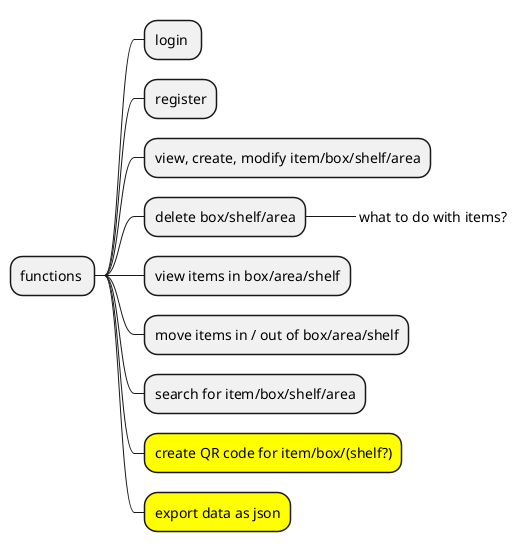

# Functions PlantUML

```plantuml
@startuml
@startmindmap
* functions 
** login 
** register
** view, create, modify item/box/shelf/area
** delete box/shelf/area
***_ what to do with items?
** view items in box/area/shelf
** move items in / out of box/area/shelf
** search for item/box/shelf/area
**[#yellow] create QR code for item/box/(shelf?)
**[#yellow] export data as json
@endmindmap
@enduml
```
