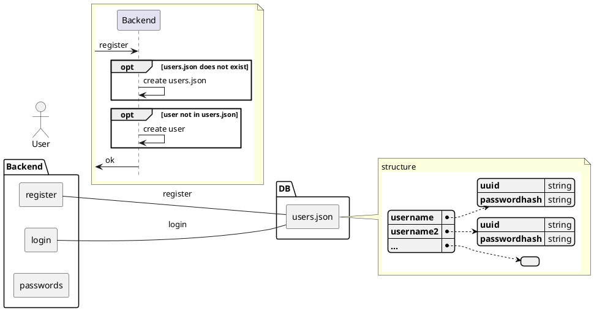

# Overview PlantUML

```plantuml
@startuml

'allowmixing
left to right direction
'top to bottom direction

actor "User" as u

package "DB" as db {
    rectangle "users.json" as usersjson
}

package "Backend" as backend {
    rectangle login
    rectangle register
    rectangle passwords
}

login -- usersjson: login
'note top on link 
'    {{
'    hide footbox
'    participant "User" as u 
'    participant "Backend" as backend
'    }}
'end note

register - usersjson: register
note top on link
    {{
    hide footbox
    'participant "User" as u 
    participant "Backend" as backend

    [-> backend: register
    opt users.json does not exist
        backend -> backend:create users.json 
    end opt
    opt user not in users.json
        backend -> backend:create user
    end opt
    [<- backend: ok
    }}
end note

note as N1
structure
{{json
    {
        "username":{"uuid":"string", "passwordhash":"string"},
        "username2":{"uuid":"string", "passwordhash":"string"},
        "...":{}
    }
    
}}
end note

'note as N2
'example
'{{json
'    [
'    {"id":"60e334c5-fc28-4078-99b1-045398e3c595", "username":"alex", "pass_hash":"$2a$14$T5bwlX2LyDZkB1euaTy0ZuUI3R1FFXbgl4IW5zJJFM00euzG6Xci2"},
'
'    {"id":"443f0835-b2a6-44d9-b68b-19248b43e970", "username":"admin", "pass_hash":"$2a$14$T5bwlX2LyDZkB1euaTy0ZuUI3R1FFXbgl4IW5zJJFM00euzG6Xci2"} 
'    ]
'
'    }}
'end note

usersjson .. N1
'usersjson .. N2

@enduml
```
