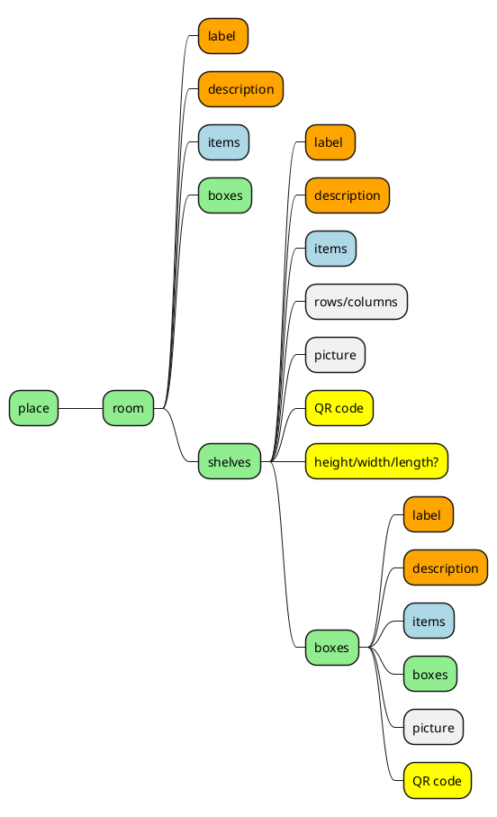

# Place PlantUML

```plantuml
@startuml
@startmindmap
*[#lightgreen] place
**[#lightgreen] room
***[#Orange] label 
***[#Orange] description
***[#lightblue] items
***[#lightgreen] boxes
***[#lightgreen] shelves
'**** shelve 
****[#Orange] label 
****[#Orange] description
****[#lightblue] items
**** rows/columns
**** picture
****[#yellow] QR code
****[#yellow] height/width/length?
****[#lightgreen] boxes
*****[#Orange] label 
*****[#Orange] description
*****[#lightblue] items
*****[#lightgreen] boxes
***** picture
*****[#yellow] QR code
@endmindmap
@enduml
```
